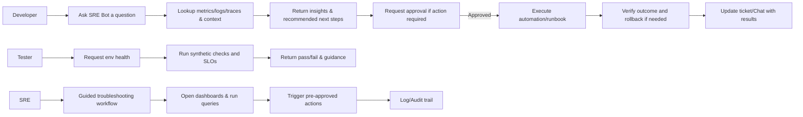
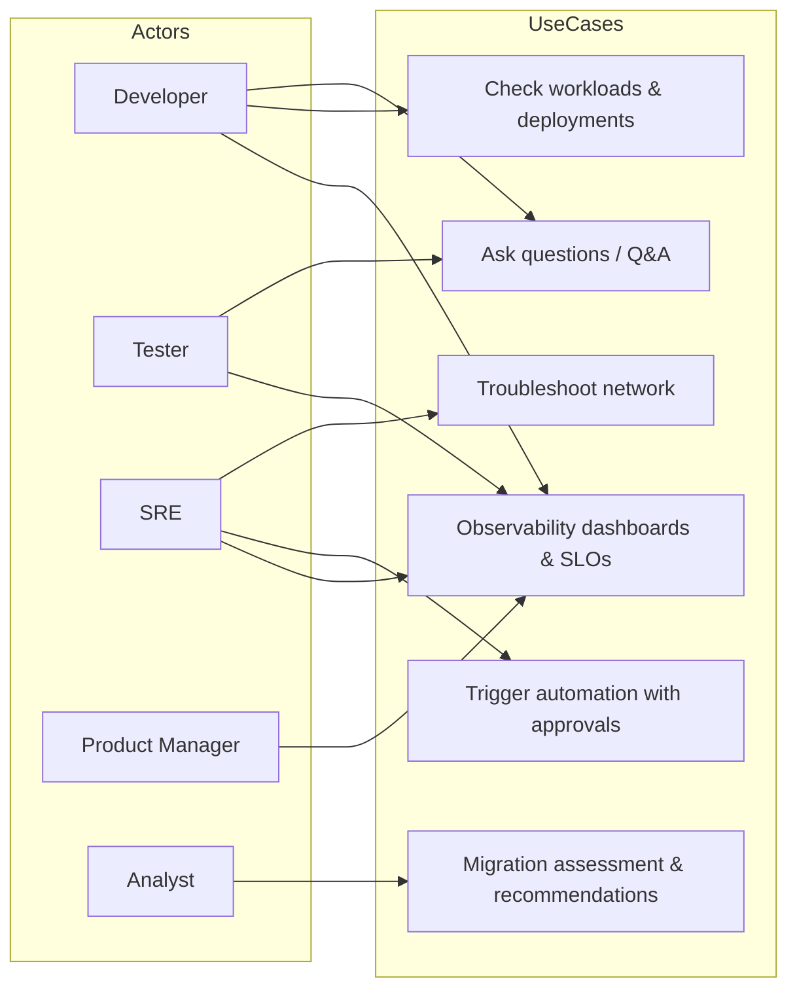

# SRE Bot — Architecture, Journeys, Use Cases & Roadmap

## High-Level Component Architecture
```mermaid
flowchart LR
  subgraph Cloud_Providers[Cloud Providers]
    AWS[AWS]
    Azure[Azure]
    GCP[GCP]
  end

  subgraph Platform[Kubernetes Platform]
    EKS[EKS / AKS / ECS]
    Addons[EKS Add-ons (CNI, CoreDNS, Ingress, CSI, Autoscaling, ExternalDNS)]
    Tenancy[Tenancy & Policy (Namespaces, Quotas, NetPol)]
    GitOps[GitOps/CD]
  end

  subgraph Observability[Observability]
    Metrics[Metrics (Prometheus)]
    Logs[Logs (Fluent Bit -> CloudWatch)]
    Traces[Traces (OpenTelemetry)]
    Dash[Dashboards & SLO/SLI]
  end

  subgraph SRE_Bot[SRE Bot]
    ChatOps[ChatOps]
    API[API / CLI / IDE]
    Agent[Agent / MCP Server]
    Runbooks[Runbook Automation + Approvals]
  end

  subgraph Users[Users]
    Dev[Developer]
    Tester[Tester]
    SRE[SRE]
    PM[Product Manager]
    Analyst[Analyst]
  end

  AWS --> EKS
  Azure --> EKS
  GCP --> EKS
  EKS --> Addons
  Addons --> Observability
  Observability -->|Insights| SRE_Bot
  SRE_Bot -->|Actions| Addons
  SRE_Bot -->|Automations| Runbooks
  Users -->|Questions| SRE_Bot
  SRE_Bot -->|Tickets/Updates| Users
```

## User Journeys


## Use Case Diagram


## 10 Sprint Roadmap → 5 Monthly Releases (Higher-Level)
- **Release 1 (Sprints 1–2):** Infrastructure baseline (E1), Platform foundations (E2).  
- **Release 2 (Sprints 3–4):** EKS Add-ons (E3), Observability foundations (E4).  
- **Release 3 (Sprints 5–6):** Network troubleshooting (E6) and Automation groundwork (E7).  
- **Release 4 (Sprints 7–8):** Migration features (E5) and Approvals/guardrails expansion (E7).  
- **Release 5 (Sprints 9–10):** Security/NFR hardening (E8), Documentation & Training (E9), Enablement (E10).

### Sprint Goals (2 weeks each)
1. **Sprint 1:** Provision AWS EKS baseline; IAM/RBAC; secrets; networking foundations.  
2. **Sprint 2:** Azure/GCP clusters; cross-cloud connectivity; data residency controls; golden paths v1.  
3. **Sprint 3:** EKS add-ons (CNI, CoreDNS, metrics-server, ExternalDNS); ingress strategy; GitOps bootstrap.  
4. **Sprint 4:** Observability stack (Prometheus/Alertmanager, OTel), dashboards, alerting & incident routing.  
5. **Sprint 5:** VPC flow logs, DNS checks, guided troubleshooting (bot); ChatOps integration.  
6. **Sprint 6:** Runbook automation (top 5), approvals with RBAC, blast-radius controls; SLO/error budgets live.  
7. **Sprint 7:** Migration inventory & scoring; strategy engine; blue/green/canary templates for migrations.  
8. **Sprint 8:** Migration pilot; cutover/rollback runbooks; support model for waves.  
9. **Sprint 9:** Security/NFR (WAF/GuardDuty, perf, chaos, backup/DR); docs portal live.  
10. **Sprint 10:** Training for personas; API/CLI/IDE & MCP enablement; polish and production-readiness.

> **Constraints & Assumptions from Scope:**  
> - Read-only permissions at all levels, write in bot namespace only.  
> - No data leaves org perimeter; local LLM hosting where needed.  
> - Data residency requirements, encryption at rest/in transit.  
> - Consumption modes: API, CLI, IDE, ChatOps, MCP Server; agents/chatbot supported.